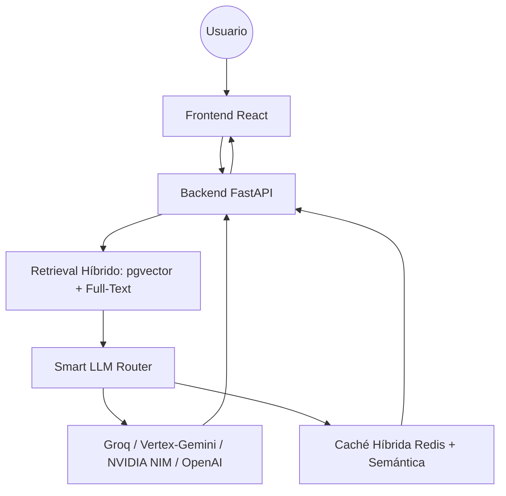

# 🛰️ ConsultaSmart (Chatbot IA Multitenant)

## 1. Descripción
**ConsultaSmart** es un proyecto satélite del ecosistema **CASMARTS**. Es una plataforma de chatbot inteligente multitenant basada en RAG (*Retrieval-Augmented Generation*): cada tema/tenant (Registro Público de la Propiedad, IRCEP, Catastro, Control Escolar, Mesa de Ayuda, etc.) tiene su propio System Prompt, guardrails, apariencia y base documental, administrables desde un panel (`/admin`) sin tocar código.

**Este proyecto (ConsultaSmart) es el proyecto principal responsable de personalizar y administrar el chat**: toda la configuración de cada chatbot (prompt, guardrails, apariencia, proveedor de IA, base documental, pruebas de regresión y observabilidad) se crea, edita y gobierna íntegramente desde su propio backend/panel de administración — no depende de ninguna herramienta externa de orquestación (ver §4) ni de otro repositorio del ecosistema para esa función.

## 2. Integración con Casmarts Core
Este proyecto funciona de manera dependiente del **Casmarts Core**, lo que garantiza soberanía de datos y eficiencia de recursos.

### Dependencias Centralizadas:
*   **Base de Datos:** PostgreSQL (host `10.4.3.208`) con extensión `pgvector` para embeddings.
*   **Caché y Celery:** `casmarts-core-cache` (Valkey/Redis) para tareas asíncronas y caché híbrida de respuestas.
*   **Almacenamiento S3:** `casmarts-core-storage` (SeaweedFS) para los archivos originales subidos.
*   **Identidad:** Authentik (OIDC/SSO) — no hay usuario/contraseña propios de ConsultaSmart; ver `MANUAL_TECNICO_DESARROLLADOR.md` §3.
*   **Gateway:** El acceso está centralizado a través del Gateway Nginx del Core.

## 3. Arquitectura del Proyecto
*   **Frontend:** React 19 (Vite + Tailwind CSS v4) — `/frontend`.
*   **Backend:** FastAPI (Python) asíncrono con SQLAlchemy — `/backend`.
*   **Workers:** Celery para procesamiento asíncrono de documentos y generación de embeddings.
*   **Agentes y Skills:** Lógica especializada ubicada en `/agents` y `/skills`.

## 4. Motor de IA — Smart LLM Router (sin orquestador externo)

ConsultaSmart **no depende de una plataforma de orquestación visual externa** (no usa Flowise, n8n ni similares — verificado: cero referencias en el código, `requirements.txt`, `package.json` o `docker-compose.yml`). El enrutamiento de modelos vive directamente en el backend, en `backend/app/infrastructure/external/smart_llm_router.py`:

- **Enrutador multiproveedor con fallback automático:** Groq (Llama 3), GCP Vertex AI/Gemini, NVIDIA NIM Cloud, con reintento y degradación automática si un proveedor falla o se satura.
- **LLM personalizado por tema:** cada tema puede configurar su propio proveedor (Groq/Gemini/NVIDIA/OpenAI) y clave de API — la clave se cifra en reposo (`app/core/crypto.py`) y nunca se expone en claro.
- **Retrieval híbrido:** búsqueda vectorial (`pgvector`, distancia coseno) **+** búsqueda léxica (`to_tsvector`/`ts_rank` en español) en paralelo, para no depender solo de similitud semántica en casos como folios o identificadores exactos.
- **Caché semántica híbrida:** Redis para consultas exactas + embeddings locales (SentenceTransformers) para detectar preguntas casi idénticas por similitud.

### Diagrama real de flujo


## 5. Funcionalidades del Panel de Administración (`/admin`)

Ver el manual de usuario `CA-CS-M-01_Manual_de_usuario_ConsultaSmart_Admin.docx` para el procedimiento completo. Resumen funcional:

| Funcionalidad | Descripción |
| :--- | :--- |
| Temas/tenants | Alta y configuración de chatbots independientes (System Prompt, guardrails, apariencia). |
| Generador de prompts | Meta-prompting asistido (metodologías CRAFT / CREA / ASPECCT). |
| Salud de indexado | Porcentaje de fragmentos con embedding real por documento, con reintento de indexado sin re-subir el archivo. |
| Batería de regresión de prompts | Preguntas de referencia por tema, ejecutables con un clic para detectar si un cambio de prompt rompió respuestas antes correctas. |
| Feedback de usuario | Votos "útil"/"no útil" por respuesta del chat, agregados en el panel de observabilidad. |
| Observabilidad | Proveedores de IA activos, tasa de satisfacción y estado de la caché semántica. |
| Gestión de usuarios y roles | Alta/baja del rol `admin` sobre cuentas de Authentik, con confirmación explícita. |

## 6. Acceso y Desarrollo

### URLs de Acceso (desarrollo local, según `docker-compose.yml`):
| Servicio | URL local |
| :--- | :--- |
| Frontend | `http://localhost:8201` |
| Backend / API | `http://localhost:8202` |
| Documentación API (Swagger) | `http://localhost:8202/docs` |

En producción, el acceso real pasa por el Gateway Nginx del Core (`chat.casmart.internal`), no por estos puertos directos.

### Ejecución Local:
Para iniciar el proyecto satélite (una vez que el Core esté corriendo):
```bash
docker compose up -d
```

## 7. Conexión Externa (DBA)
Si deseas conectar herramientas externas (Navicat, DBeaver) a la base de datos de este proyecto:
*   **Host:** `10.4.3.208`
*   **Puerto:** `5432`
*   **Base de Datos:** `consultarpp_db`
*   **Usuario:** `consultarpp_user`
*   **Contraseña:** definida en `.env` / Vault (**nunca** el fallback hardcodeado de `docker-compose.yml`/`config.py` en un entorno real — ver hallazgo SEC-01 en `MANUAL_TECNICO_DESARROLLADOR.md` §8).

## 8. Documentación relacionada
- `MANUAL_TECNICO_DESARROLLADOR.md` — arquitectura completa, modelo de datos, matriz de autenticación por endpoint, y bitácora de auditoría de seguridad.
- `CA-CS-M-01_Manual_de_usuario_ConsultaSmart_Admin.docx` — manual de usuario del panel de administración.
- Pestaña **Documentación** dentro de la propia aplicación (`/documentacion`) — guía operativa in-app con ejemplos reales de la API.

---
*Resident Agent Genesis Protocol - CASMARTS Satellite Integration.*
