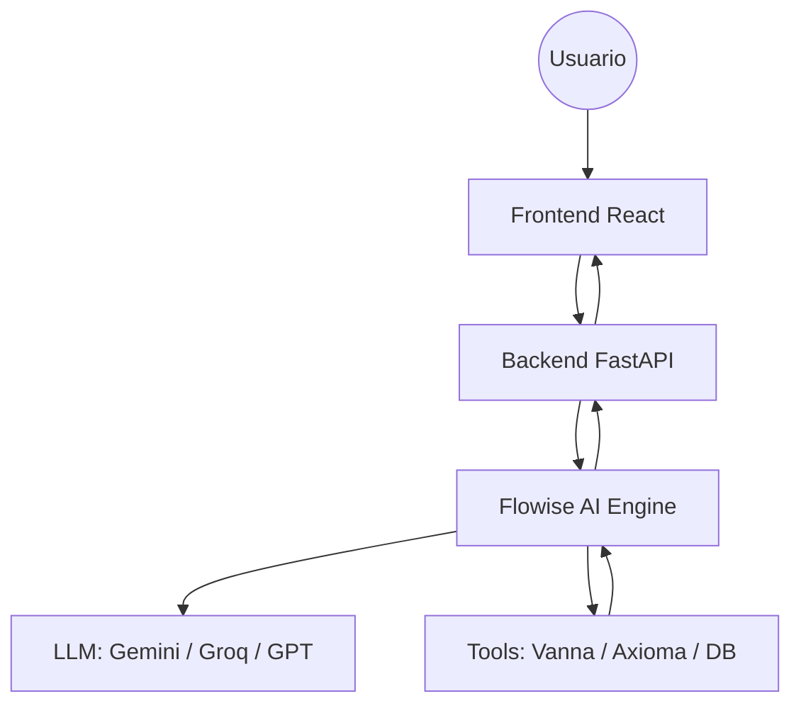

# 🛰️ Consulta-Smart (Chatbot IA)

## 1. Descripción
**Consulta-Smart** es un proyecto satélite del ecosistema **CASMARTS**. Es un chatbot inteligente diseñado para la consulta y análisis de documentos del Registro Público de la Propiedad (RPP), integrando capacidades de RAG (Retrieval-Augmented Generation).

## 2. Integración con Casmarts Core
Este proyecto ha sido migrado para funcionar de manera dependiente del **Casmarts Core**, lo que garantiza soberanía de datos y eficiencia de recursos.

### Dependencias Centralizadas:
*   **Base de Datos:** Utiliza el servicio `casmarts-core-db` (PostgreSQL 18.3 + pgvector).
*   **Caché y Celery:** Utiliza `casmarts-core-cache` (Valkey) para gestión de tareas asíncronas y estados.
*   **Almacenamiento S3:** Utiliza `casmarts-core-storage` (SeaweedFS) para el almacenamiento de documentos analizados.
*   **Gateway:** El acceso está centralizado a través del Gateway Nginx del Core.

## 3. Arquitectura del Proyecto
*   **Frontend:** React 19 (Vite) - Ubicado en `/frontend`.
*   **Backend:** FastAPI (Python 3.10) - Ubicado en `/backend`.
*   **Workers:** Celery para procesamiento pesado de documentos y embeddings.
*   **Agentes y Skills:** Lógica especializada ubicada en `/agents` y `/skills`.

## 4. Orquestación con Flowise AI

Consulta-Smart utiliza **Flowise AI** como motor de orquestación visual para sus agentes de IA. Esta integración permite separar la lógica de negocio de la infraestructura de IA, facilitando la iteración rápida de prompts y modelos.

### Arquitectura de Flujo


### Ventajas y Desventajas
| **Aspecto** | **Ventajas** | **Desventajas** |
| :--- | :--- | :--- |
| **Desarrollo** | Prototipado visual ultra rápido y depuración de cadenas en tiempo real. | Curva de aprendizaje inicial de la herramienta visual. |
| **Mantenibilidad** | Cambio de modelos (ej. de Gemini a Groq) sin tocar una sola línea de código en el backend. | Dependencia de un servicio adicional en el stack. |
| **Extensibilidad** | Fácil integración con Custom Tools vía HTTP o Python. | Latencia marginal adicional debido al salto entre servicios. |

## 5. Acceso y Desarrollo
### URLs de Acceso (Vía Gateway):
| **Interfaz de Usuario:** `http://<IP_CORE>/consultarpp/` (Puerto: `3006`)
| **Documentación API:** `http://<IP_CORE>/consultarpp/api/docs` (Puerto: `3005`)

### Ejecución Local:
Para iniciar el proyecto satélite (una vez que el Core esté corriendo):
```bash
docker compose up -d
```

## 5. Conexión Externa (DBA)
Si deseas conectar herramientas externas (Navicat, DBeaver) a la base de datos de este proyecto:
*   **Host:** `<IP_DEL_SERVIDOR>`
*   **Puerto:** `5432`
*   **Base de Datos:** `consultarpp_db`
*   **Usuario:** `consultarpp_user`
*   **Contraseña:** `SuperSecure_ConsultaRPP_2026!` (Configurable en .env)

---
*Resident Agent Genesis Protocol - CASMARTS Satellite Integration.*
